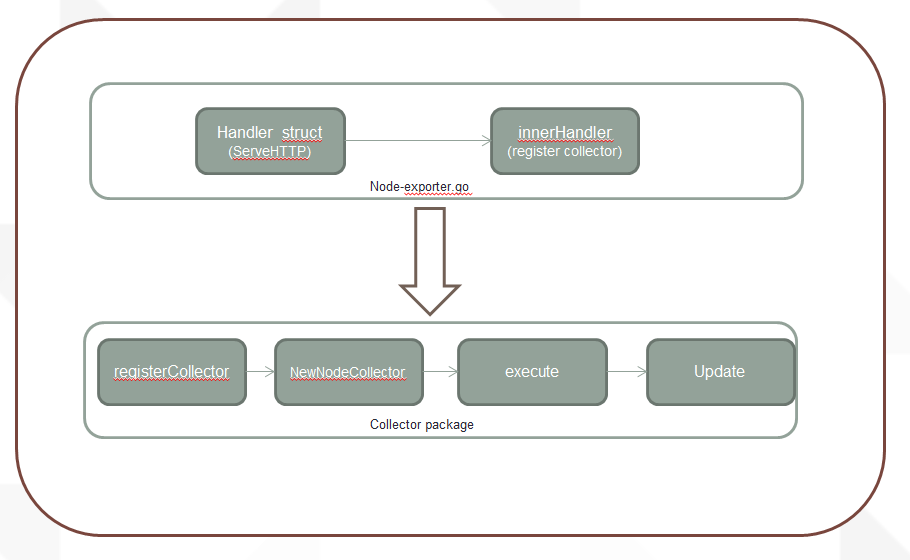

Node-exporter-dev
================



```golang
func init() {
        registerCollector("grafanainfo", defaultEnabled, NewGrafanainfoCollector)
}

func NewGrafanainfoCollector(logger log.Logger) (Collector, error) {
        return &grafanainfoCollector{logger}, nil
}


func (c *grafanainfoCollector) Update(ch chan<- prometheus.Metric) error {
        grafanaInfo, err := c.getGrafanaInfo()
        if err != nil {
                return fmt.Errorf("couldn't get grafanainfo: %w", err)
        }
        level.Debug(c.logger).Log("msg", "Set grafana", "grafanaInfo", grafanaInfo)
        for k, v := range grafanaInfo {
                ch <- prometheus.MustNewConstMetric(
                        prometheus.NewDesc(
                                prometheus.BuildFQName("grafana", "status", k),
                                fmt.Sprintf("Grafana information field %s.", k),
                                nil, nil,
                        ),
                        prometheus.GaugeValue, v,
                )
        }
        return nil
}
```
